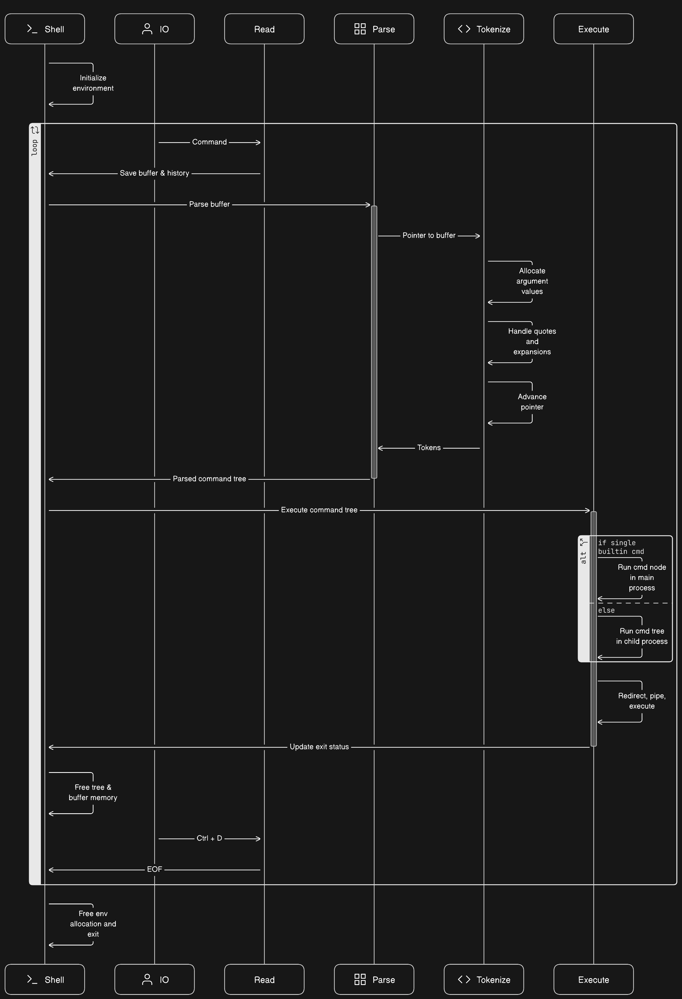

****<h1 align="center">
	📖 Minishell
</h1>

<h2 align="center">
	42 Lisbon Cursus - November 2023
</h2>

	
	
	

## Summary

https://github.com/marcpaq/shellancestry
https://en.wikipedia.org/wiki/Comparison_of_command_shells

A CLI shell program that features a set of basic functionalities, including:

- Pipes
- Redirections
- Environment variables
- Expansions
- Quote handling
- Exit status
- Signals (Ctrl-C, and Ctrl-\\ handling)
- History
- Builtins
  - echo
  - cd
  - pwd
  - export
  - unset
  - env
  - exit

## Subject
[📗️](en.subject.pdf) 

## Flowchart

## Submodules 
- Run `git submodule update --init --recursive` to get submodules
- To update the submodules run `git submodule update --remote --merge`
